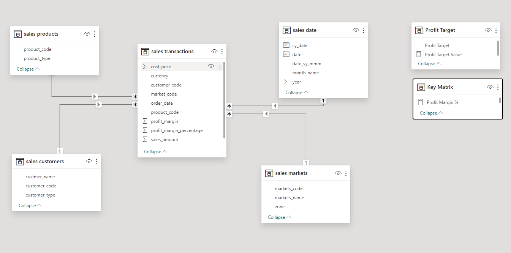

# Hardware-Sales-Analysis_and_Insights

🎯 Project Objective:
In this collaborative project utilizing SQL and Power BI, our focus is on analyzing AtliQ Hardware sales data to derive valuable insights essential for informed business decisions and strategic initiatives aimed at fostering growth in light of the organization's declining sales.

Data Model :

Overview Report :

[See Full Dashboard Here!](https://app.powerbi.com/view?r=eyJrIjoiNDk0MzNkNTAtYzliMS00Y2E5LWFlZjAtZDkzN2JlYWIzN2RkIiwidCI6ImRmODY3OWNkLWE4MGUtNDVkOC05OWFjLWM4M2VkN2ZmOTVhMCJ9)

💡 Project Process -->

1. Data Collection: Gathered comprehensive data from diverse zones and markets to ensure a holistic representation of sales performance.

2. Data Analysis: Conducted thorough data mining to extract meaningful patterns and trends, enabling a deeper understanding of the factors contributing to the declining sales.

3. Key Performance Indicators (KPIs): Identified and highlighted crucial KPIs such as revenue, sales by markets, top 5 customers, and revenue percentage by customer type. 
These KPIs serve as pivotal metrics for assessing and addressing sales challenges.

4. Aspect-Focused Analysis: Analyzed various aspects impacting sales, delving into market-specific dynamics, customer behavior, and product performance to provide a nuanced perspective.

5. Visual Representation: Developed visually engaging and colorful visuals for the dashboard, ensuring that complex data is presented in an easily digestible format. 
Visual elements include graphs, charts, and tables that enhance the accessibility and interpretability of the information.

6. Conciseness: Maintained a concise presentation style to convey critical information efficiently. The dashboard prioritizes clarity and simplicity to facilitate quick comprehension by stakeholders.

7. Professional Presentation: Ensured a professional look and feel for the dashboard, aligning with industry standards. The layout is intuitive, with a user-friendly interface to encourage widespread adoption among decision-makers.

🛠️ Tools Used :

● MySQL:
1. Database Dump
2. Data Checkup & Cleanup
3. Ad Hoc Analysis
4. Solved business problems through SQL queries.

● Power BI:
1. Data Import
2. DAX Queries & Measures Creation 
3. Report Building & Visualization

📊 Insights -

● Key Insight Report:
1. Sales declined from 25.7M to 14.7M from Jan-Jun 2020, likely due to the COVID-19 effect.
2. Delhi (77.7M, 0.14M) and Mumbai (20.2M, 0.04M) are the top 2 markets by revenue and sales quantity.
3. Brick and Mortar contribute 79.55% to revenue, while E-commerce contributes 20.45%.

● Performance Insights Report:
1. Revenue in 2020 is declining compared to 2019, with profit margin trends declining in Feb 2020 and fluctuating through Jun 2020.
2. Bhubneshwar, Hyderabad, and Chennai are the top 3 markets with the highest profit margin %, while Surat, Delhi NCR, and Kanpur have low profit margins, with Lucknow showing a negative profit margin of -2.7%.

● Profit Analysis Report:
1. Mumbai, Delhi NCR, and Ahmedabad contribute the highest profit percentages, with Lucknow showing negative profit contribution.
2. Delhi NCR leads in revenue contribution at 54.7%, followed by Mumbai and Ahmedabad.

🔄 Recommendations -

1.  Address Sales Decline (COVID Impact):
● Action: Reassess marketing strategies and focus on pandemic recovery measures to boost sales in the affected period (Jan-Jun 2020). Target regions with the greatest decline with special promotions or offers.
● Rationale: Sales decline could be linked to the COVID-19 pandemic. Recovery can be aided by adapting sales strategies to the new environment, focusing on high-impact markets.

2. Enhance E-commerce Presence:
● Action: Increase investment in E-commerce channels to narrow the revenue gap with Brick and Mortar stores. Focus on improving the online shopping experience, faster delivery, and promotions.
● Rationale: While Brick and Mortar stores contribute the most (79.55%), E-commerce represents a smaller share (20.45%) that could be expanded to capture additional revenue streams.

3. Target High-Performing Markets:
● Action: Increase targeted efforts in high-performing markets like Delhi, Mumbai, and Ahmedabad by offering exclusive deals, loyalty programs, and personalized marketing.
● Rationale: These markets are contributing significantly to both revenue and profits. Strengthening engagement here can further boost sales.

4. Focus on Low-Profit Margins:
● Action: Investigate and optimize operations in low-profit margin markets like Lucknow, Kanpur, and Delhi NCR. Consider pricing adjustments or cost-cutting measures to improve margins.
● Rationale: Markets with low or negative profit margins should be analyzed for inefficiencies, and strategies should be put in place to improve profitability.

5. Monitor Profit Margins by Region:
● Action: Continue to prioritize markets like Bhubneshwar, Hyderabad, and Chennai, where profit margins are strong, while adjusting strategies in lower-margin areas.
● Rationale: Profit margins should be a key indicator for strategic focus. By allocating resources to high-margin markets, overall profitability can be boosted.

6. Boost Profitability in Negative Margin Areas:
● Action: Investigate Lucknow's negative profit margin and explore cost reduction, operational efficiency, or pricing strategies to recover from the negative margin.
● Rationale: A negative profit margin indicates potential issues in cost control or pricing, which should be addressed to avoid losses.

