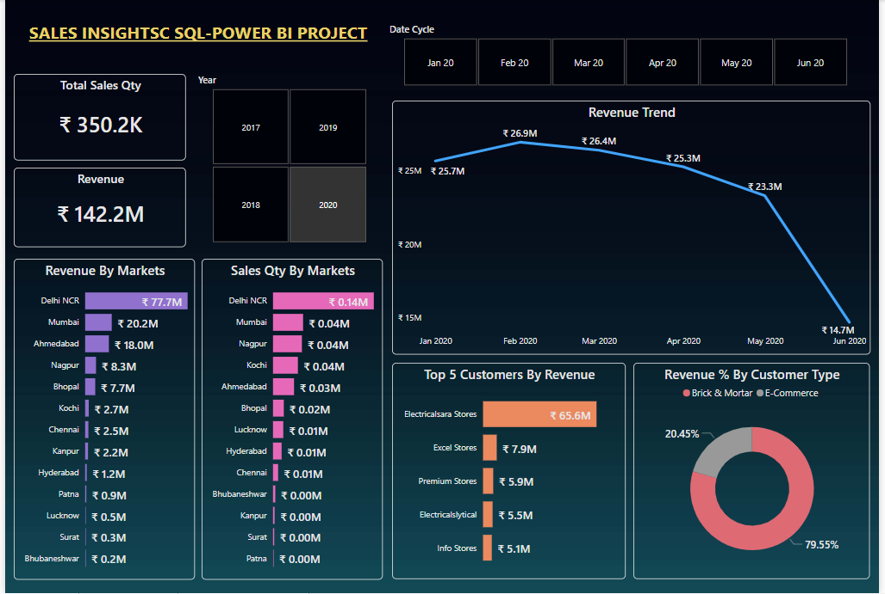

# Hardware-Sales-Analysis_and_Insights

🎯 Project Objective:
In this collaborative project utilizing SQL and Power BI, our focus is on analyzing AtliQ Hardware sales data to derive valuable insights essential for informed business decisions and strategic initiatives aimed at fostering growth in light of the organization's declining sales.

Data Model :

Overview Report :

[See Full Dashboard Here!](https://app.powerbi.com/view?r=eyJrIjoiNDk0MzNkNTAtYzliMS00Y2E5LWFlZjAtZDkzN2JlYWIzN2RkIiwidCI6ImRmODY3OWNkLWE4MGUtNDVkOC05OWFjLWM4M2VkN2ZmOTVhMCJ9)

💡 Project Process -->

1. Data Collection: Gathered comprehensive data from diverse zones and markets to ensure a holistic representation of sales performance.

2. Data Analysis: Conducted thorough data mining to extract meaningful patterns and trends, enabling a deeper understanding of the factors contributing to the declining sales.

3. Key Performance Indicators (KPIs): Identified and highlighted crucial KPIs such as revenue, sales by markets, top 5 customers, and revenue percentage by customer type. 
These KPIs serve as pivotal metrics for assessing and addressing sales challenges.

4. Aspect-Focused Analysis: Analyzed various aspects impacting sales, delving into market-specific dynamics, customer behavior, and product performance to provide a nuanced perspective.

5. Visual Representation: Developed visually engaging and colorful visuals for the dashboard, ensuring that complex data is presented in an easily digestible format. 
Visual elements include graphs, charts, and tables that enhance the accessibility and interpretability of the information.

6. Conciseness: Maintained a concise presentation style to convey critical information efficiently. The dashboard prioritizes clarity and simplicity to facilitate quick comprehension by stakeholders.

7. Professional Presentation: Ensured a professional look and feel for the dashboard, aligning with industry standards. The layout is intuitive, with a user-friendly interface to encourage widespread adoption among decision-makers.

🛠️ Tools Used :
● MySQL:
1. Database Dump
2. Data Checkup & Cleanup
3. Ad Hoc Analysis
4. Solved business problems through SQL queries.

● Power BI:
1. Data Import
2. DAX Queries & Measures Creation 
3. Report Building & Visualization

📊 Insights & Recommedations: 

